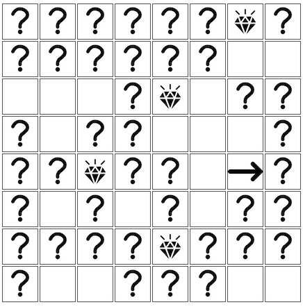

# diamond-sweeper
diamond-sweeper game

## The rules of the game are as follows:

* The game board has 8x8 squares (initially, all represented by question marks)
* There are 8 diamonds hidden on the board, each diamond behind one of the squares
* When the user clicks on a square
    * If the square was hiding a diamond, the diamond appears
    * Otherwise, the square is opened, and blank
* The game ends when all diamonds are found. The user's score is the number of squares still left unturned.

# Getting started with code

#### 1. Get the latest version

You can start by cloning the latest version of project on your
local machine by running:

```shell
$ git clone https://github.com/vishwanathsnayak/diamond-sweeper.git
$ cd diamond-sweeper
```
#### 2. Run `yarn install` or `npm install`

This will install both run-time project dependencies and developer tools listed
in [package.json](package.json) file.

#### 3. Run `yarn start` or `npm start`

This command will start the app from the source files (`/src`).
> [http://localhost:8080/](http://localhost:8080/)

Once page renders page will look like this


Whenever you modify any of the source files inside the `/src` folder, the app will recompile and refresh all the connected browsers.

#### 4. Build the app using `yarn run build` or `npm run build`

After running this command, the `/dist` folder will contain the compiled version of the app. Open `index.html` from `/dist` in browser to run the application.

#### 5. Check the source code against lint rules using `yarn run lint` or `npm run lint`

#### 6. Execute unit tests using `yarn run test` or `npm run test`

